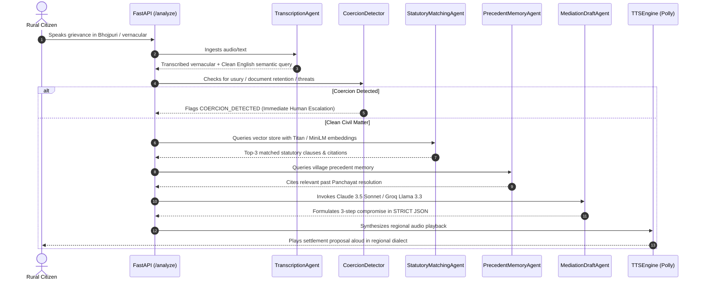

# ClearCase: AI Stack & Multi-Agent Architecture

This document provides a technical deep-dive into the AI/ML orchestration stack, statutory knowledge base ingestion, embedding models, multi-agent pipelines, safety escalation gates, and vernacular speech synthesis.

---

## 1. Complete AI Tech Stack

| Layer | Component | Model / Technology | Description |
| :--- | :--- | :--- | :--- |
| **Ingestion & Parsing** | `ingest.py` | Markdown Section Chunker | Splits statutory acts into ~300-500 token overlapping windows preserving Act title, section numbers, and titles |
| **Embeddings (Cloud)** | `ingest.py` | `amazon.titan-embed-text-v1` | 1536-dimensional dense vector embeddings generated via Amazon Bedrock Runtime |
| **Embeddings (Local)** | `ingest.py` | `sentence-transformers/all-MiniLM-L6-v2` | 384-dimensional dense semantic vectors with zero cloud cost and instant local inference |
| **Vector Store (Cloud)** | AWS OpenSearch | OpenSearch Service k-NN | Scalable vector index with cosine similarity filtering on state and district |
| **Vector Store (Local)** | ChromaDB & NumPy | ChromaDB (`./chroma_db`) & `data/local_vector_index.json` | Persistent local vector index guaranteeing 100% offline hackathon demo resilience |
| **Agent 1: Transcription** | `agents.py` | Bedrock Claude 3.5 / Dialect Normalizer | Normalizes regional dialects (Bhojpuri, Awadhi, Haryanvi, Maithili) into clean English semantic search queries |
| **Agent 2: Statutory Matcher** | `agents.py` | k-NN Vector Search + Rule Filter | Evaluates statutory relevance, returns top-3 clauses with verbatim citations and confidence scores (0-1) |
| **Agent 3: Mediation Drafter** | `agents.py` | Bedrock Claude 3.5 Sonnet / Groq Llama 3.3 70B | Formulates neutral 3-step compromise agreement in STRICT JSON adhering to retrieved clauses |
| **Feature: Precedent RAG** | `agents.py` | `PrecedentMemoryAgent` | Searches historical village dispute resolutions from Gram Panchayats (`data/village_precedents.json`) |
| **Feature: Land Record OCR** | `agents.py` | `LandRecordAgent` | Parses Khasra plot numbers, Khatauni accounts, and recorded holding areas from cadastre documents |
| **Feature: Coercion Gate** | `agents.py` | `CoercionDetector` | Detects usurious moneylending (>36%), document retention, bonded labor, or caste/gender intimidation |
| **Feature: Vernacular Voice Loop** | `agents.py` | `DialectTranslator` | Re-synthesizes formal legal compromise into authentic regional dialect speech text |
| **Feature: Lok Adalat Petitions** | `agents.py` | `PetitionGenerator` | Generates bilingual pre-litigation petitions under Section 20 of the Legal Services Authorities Act, 1987 |
| **Speech Synthesis (TTS)** | `tts.py` | Amazon Polly (`Kajal`, `Aditi`) | High-fidelity neural voice synthesis for Indian languages with offline audio fallback |

---

## 2. Multi-Agent Pipeline Sequence

---

## 3. Triple-Tier LLM Fallback Architecture

To ensure zero downtime during judging or live demos:
1. **Tier 1 (Amazon Bedrock Claude 3.5 Sonnet)**: Primary high-reasoning foundation model.
2. **Tier 2 (Groq Cloud Llama 3.3 70B Versatile / Qwen 2.5)**: Ultra-fast open-source cloud fallback via Groq API.
3. **Tier 3 (Calibrated Resilient Offline Engine)**: Instant local generator with calibrated outputs across 25+ real-world dispute categories.
