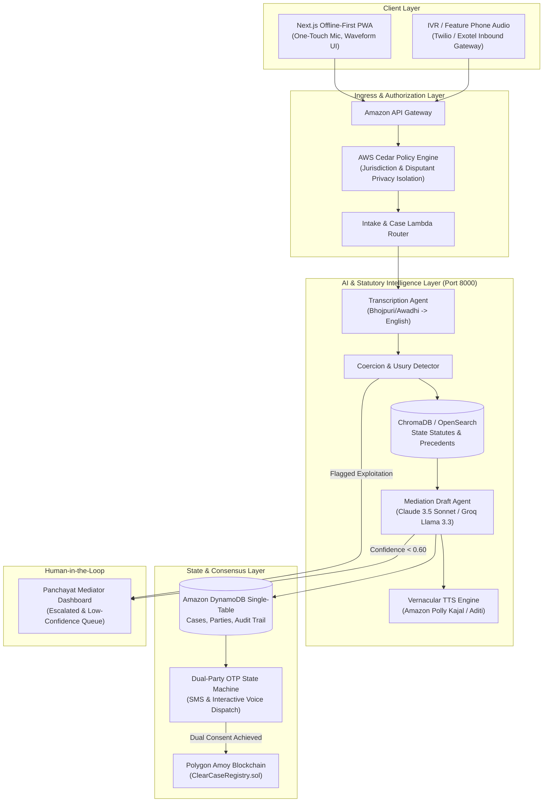

# ClearCase: Proposed Architecture, User Flow & System Diagrams

This document illustrates the end-to-end technical architecture, user journey, and data flow from vernacular voice intake to blockchain immutability.

---

## 1. End-to-End System Architecture



---

## 2. Complete User Journey

```
[1. CITIZEN A: INTAKE]
Citizen A opens the app -> Taps the microphone button -> Speaks grievance in Bhojpuri
("Mera padosi khet ki purani medh kaat kar do feet humre khet ki or bada liya hai...")

        │
        ▼
[2. AI ORCHESTRATION]
AI transcribes audio -> Translates to English -> Searches UP Revenue Code Section 24
Searches past village settlements -> Drafts 3-step compromise agreement
Plays draft aloud in Bhojpuri to Citizen A

        │
        ▼
[3. CITIZEN B: INVITE & JOIN]
System asks Citizen A for Citizen B's phone number -> Sends SMS/IVR invite with voice summary
Citizen B joins via web link or IVR -> Listens to settlement draft

        │
        ▼
[4. DUAL-PARTY OTP CONSENT]
Citizen A receives 6-digit OTP -> Submits OTP ("I Agree")
Citizen B receives 6-digit OTP -> Submits OTP ("I Agree")

        │
        ├── Both Agree? ──► [5a. CONSENT_ACHIEVED]
        │                       │
        │                       ▼
        │                   [6a. POLYGON AMOY ANCHORING]
        │                   Deterministic SHA-256 Hash computed -> Sent to ClearCaseRegistry.sol
        │                   Permanent on-chain transaction receipt returned -> Downloadable PDF
        │
        └── Disagree or Score < 0.60? ──► [5b. ESCALATED TO HUMAN]
                                            │
                                            ▼
                                        [6b. PANCHAYAT MEDIATOR QUEUE]
                                        Gram Pradhan / Lekhpal reviews AI case file on dashboard
                                        Conducts physical spot hearing -> Submits revised draft
                                        Parties re-confirm with fresh OTPs
```
