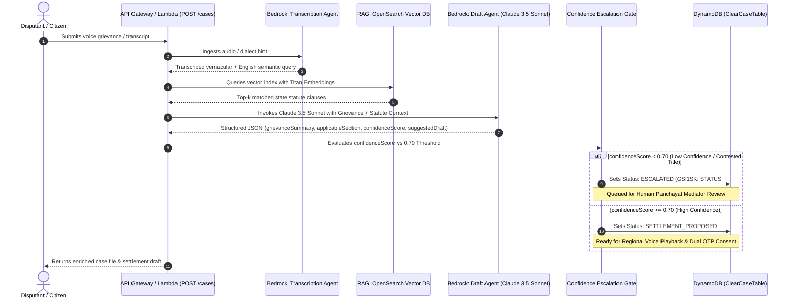

# ClearCase: AI Orchestration & Statutory RAG Architecture

This document details the multi-agent AI pipeline, Amazon Bedrock integration (`Claude 3.5 Sonnet`), OpenSearch vector RAG stub, confidence escalation engine, and resilient fallback mechanisms for **Project ClearCase**.

---

## 1. Multi-Agent Pipeline Overview



---

## 2. Amazon Bedrock Claude 3.5 Sonnet Specification

* **Model ID**: `anthropic.claude-3-5-sonnet-20240620-v1:0`
* **Inference Endpoint**: Amazon Bedrock Runtime (`InvokeModelCommand`)
* **Anthropic Version**: `bedrock-2023-05-31`
* **Temperature**: `0.2` (Low temperature for strictly grounded statutory reasoning)
* **Max Tokens**: `1500`

### 2.1. System Prompt

```text
You are "ClearCase", an autonomous AI mediation agent for rural India (Bharat).
Your mission: Given a citizen's grievance transcript and relevant statutory law, generate a neutral, plain-language, and fair settlement proposal suitable for informal village Panchayats and Lok Adalats.
You MUST respond with a raw, valid JSON object ONLY. Do not wrap in markdown backticks. Do not include introductory text.

JSON Schema to strictly adhere to:
{
  "grievanceSummary": "Clear 2-sentence neutral summary of the issue",
  "applicableSection": "<Act Name>, <Section Number>: <Clause Title>",
  "confidenceScore": 0.85, // Number between 0.00 and 1.00 indicating confidence that this dispute can be resolved under the cited law without formal litigation
  "suggestedDraft": "Neutral, non-binding 3-step compromise agreement in plain language",
  "escalationRecommended": false, // true if score < 0.70 or involves criminal/title ownership/matrimonial dispute
  "escalationReason": "Required only if escalationRecommended is true"
}
```

### 2.2. User Prompt Template

```text
Grievance Transcript:
"{{transcript}}"

Matched Statutory Law:
- Act: {{statute.act}}
- Section: {{statute.section}} ({{statute.clauseTitle}})
- Relevance: {{statute.relevanceSummary}}

Language / Dialect Context: {{dialect}}

Formulate the structured settlement proposal in JSON.
```

---

## 3. Exact JSON Schemas Returned by AI Agents

### 3.1. Transcription Result (`TranscriptionResult`)
```json
{
  "originalText": "Padosi khet ki purani medh kaat kar do feet humre khet ki or bada liya hai gehu buaai ke samay.",
  "englishText": "The neighboring landowner cut down the boundary ridge and encroached two feet into my field during wheat sowing.",
  "detectedDialect": "bhojpuri",
  "confidence": 0.96
}
```

### 3.2. Statutory Match Result (`StatutoryMatchResult`)
```json
[
  {
    "act": "Uttar Pradesh Revenue Code, 2006",
    "section": "Section 24",
    "clauseTitle": "Settlement of boundary disputes and demarcation",
    "relevanceSummary": "Authorizes the Sub-Divisional Officer / Tehsildar to demarcate boundaries of agricultural holdings based on official village cadastre maps (Shajra/Khasra) through a spot inspection by the Lekhpal.",
    "similarityScore": 0.92
  }
]
```

### 3.3. Mediation Draft Result (`MediationDraftResult`)
```json
{
  "grievanceSummary": "Dispute regarding an alleged 2-foot boundary ridge (medh) encroachment between adjacent agricultural holdings during seasonal ploughing.",
  "applicableSection": "Uttar Pradesh Revenue Code, 2006, Section 24: Settlement of boundary disputes and demarcation",
  "confidenceScore": 0.86,
  "suggestedDraft": "1. Both parties mutually consent to request a joint ridge inspection by the local Village Lekhpal based on the official village Shajra map.\n2. Both landholders agree to restore the boundary ridge to the coordinates marked during the inspection without altering irrigation channels.\n3. Both parties commit to maintain peaceful possession and refrain from entering the neighbor’s demarcated plot.",
  "escalationRecommended": false
}
```

### 3.4. Low-Confidence / Escalated Result (`MediationDraftResult`)
```json
{
  "grievanceSummary": "The dispute involves allegations of ancestral title overlap and unrecorded partition documentation between family branches.",
  "applicableSection": "Civil Procedure Code, 1908, Section 89",
  "confidenceScore": 0.58,
  "suggestedDraft": "Because this matter touches upon unregistered partition deeds and competing hereditary ownership claims, automated settlement is restricted. Physical review and spot hearing before the Gram Panchayat Mediator and Revenue Lekhpal is required.",
  "escalationRecommended": true,
  "escalationReason": "Statutory confidence score 0.58 is below the 0.70 threshold due to contested ancestral title records requiring physical document verification."
}
```

---

## 4. Confidence Escalation Engine (< 0.70 Threshold)

ClearCase implements a strict AI safety guardrail: **The AI knows its own limits.**

```typescript
const ESCALATION_THRESHOLD = 0.70;

if (draft.confidenceScore < ESCALATION_THRESHOLD || draft.escalationRecommended) {
  targetStatus = 'ESCALATED';
} else {
  targetStatus = 'SETTLEMENT_PROPOSED';
}
```

* **When Confidence $\ge 0.70$**:
  The case is classified as a straightforward, resolvable dispute with clear statutory backing (e.g., standard boundary demarcation, undisputed wage delays). The status transitions to `SETTLEMENT_PROPOSED`, triggering voice playback (TTS) and sending OTP consent requests to both parties.
* **When Confidence $< 0.70$** (or contested title, criminal violence, or matrimonial matters):
  The system prevents hallucinated compromises. It automatically assigns status `ESCALATED`, persisting the `escalationReason` to DynamoDB. The case is re-indexed in the GSI `MediatorQueueIndex` (`GSI1SK: STATUS#ESCALATED`), instantly popping up on the human Panchayat Mediator dashboard.

---

## 5. Resilient Fallback Engine (`MOCK_AI=true`)

To guarantee smooth hackathon live demonstrations and prevent API quota, latency, or AWS credential issues from breaking frontend evaluation:
1. **Environment Flag**: Setting `MOCK_AI=true` instructs `src/services/aiService.ts` to bypass network hops to Bedrock and return calibrated, hyper-realistic legal outputs.
2. **Automatic Network Fallback**: If Bedrock credentials are not configured or an AWS network timeout occurs, the service logs a warning and automatically returns the resilient mock output rather than crashing the request.
3. **Calibrated Scenarios**:
   - Boundary ridge dispute (`medh`, `boundary`) -> `UP Revenue Code 2006, Sec 24` (Score: `0.86`) -> `SETTLEMENT_PROPOSED`.
   - Farm wage dispute (`wage`, `majdoori`) -> `Minimum Wages Act 1948, Sec 20` (Score: `0.88`) -> `SETTLEMENT_PROPOSED`.
   - Contested title dispute (`title`, `deed`, `ancestry`) -> Score: `0.58` -> `ESCALATED`.
