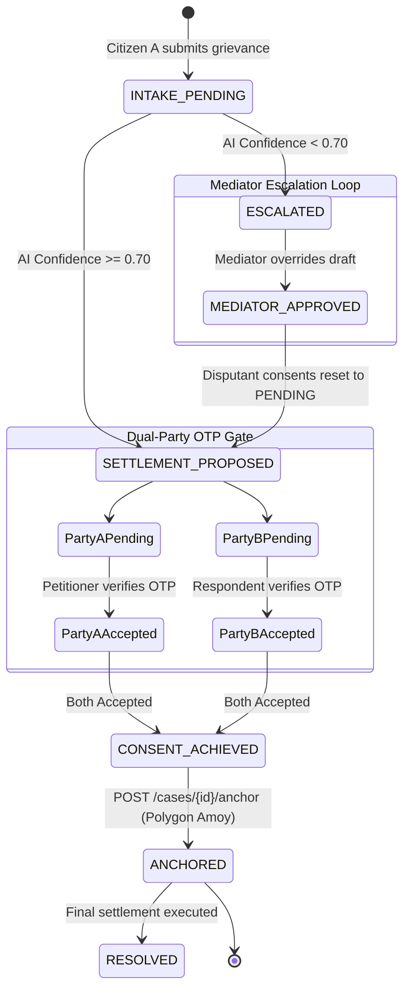

# ClearCase: Backend Architecture & API Endpoint Summary

> **Offline-First, Voice-Native AI Dispute Resolution Mesh for Bharat**  
> Hackathon: *Bharat Builds by WeMakeDevs* | Track: AWS First Commit

This document provides a comprehensive reference of the ClearCase backend architecture, data model, security/authorization rules, and every REST API endpoint exposed by the Amazon API Gateway Lambda router.

---

## 📑 Table of Contents
1. [System Architecture & Request Lifecycle](#1-system-architecture--request-lifecycle)
2. [Data Model: DynamoDB Single-Table Design](#2-data-model-dynamodb-single-table-design)
3. [Authorization: AWS Cedar Security Model](#3-authorization-aws-cedar-security-model)
4. [Standard Request & Response Envelopes](#4-standard-request--response-envelopes)
5. [Complete Endpoint Reference](#5-complete-endpoint-reference)
   - [Health & Diagnostics](#health--diagnostics)
     - [`GET /health`](#1-get-health)
   - [Dispute Intake & Management](#dispute-intake--management)
     - [`POST /cases`](#2-post-cases-intake--ai-orchestration)
     - [`GET /cases/{id}`](#3-get-casesid-case-metadata)
     - [`GET /cases/{id}/full`](#4-get-casesidfull-case-aggregate)
     - [`POST /cases/{id}/analyze`](#5-post-casesidanalyze-re-analysis)
     - [`POST /cases/{id}/escalate`](#6-post-casesidescalate-manual-escalation)
     - [`PATCH /cases/{id}/status`](#7-patch-casesidstatus-administrative-status-update)
   - [Parties & Dual-Party OTP Consent](#parties--dual-party-otp-consent)
     - [`POST /cases/{id}/join`](#8-post-casesidjoin-party-onboarding)
     - [`GET /cases/{id}/parties`](#9-get-casesidparties-list-parties)
     - [`POST /cases/{id}/confirm`](#10-post-casesidconfirm-otp-verification--dual-consent)
   - [Human Mediator Workflow & Queues](#human-mediator-workflow--queues)
     - [`GET /mediator-queue`](#11-get-mediator-queue-panchayat-queue)
     - [`PATCH /cases/{id}/mediator-review`](#12-patch-casesidmediator-review-draft-override)
   - [Blockchain Anchoring & Immutability](#blockchain-anchoring--immutability)
     - [`POST /cases/{id}/anchor`](#13-post-casesidanchor-polygon-amoy-anchoring)
   - [Audit Trail & Governance](#audit-trail--governance)
     - [`GET /cases/{id}/audit`](#14-get-casesidaudit-immutable-audit-trail)
6. [State Transition Lifecycle](#6-state-transition-lifecycle)
7. [Environment & Configuration Reference](#7-environment--configuration-reference)

---

## 1. System Architecture & Request Lifecycle

```
[Citizen / Mediator / IVR]
           │
           ▼
[Amazon API Gateway (REST HTTP)]
           │
           ▼
[AWS Lambda Catch-All Router (`src/app.ts`)]
           │
   ┌───────┴───────────────────────────────┬───────────────────────────────┐
   │                                       │                               │
   ▼                                       ▼                               ▼
[AWS Cedar AuthZ Engine]        [Bedrock Multi-Agent AI]        [Polygon Amoy Blockchain]
- Citizen Isolation             - Transcription Agent           - Canonical SHA-256 Hashing
- Mediator Jurisdiction Guard   - OpenSearch Statutory RAG      - ClearCaseRegistry.sol
- Queue Access Guard            - Claude 3.5 Sonnet Draft       - 2.5s Resilient Fallback
   │                                       │                               │
   └───────┬───────────────────────────────┴───────────────────────────────┘
           │
           ▼
[Amazon DynamoDB (Single-Table: `ClearCaseTable`)]
- Metadata (`CASE#<id>`, `METADATA`)
- Parties (`CASE#<id>`, `PARTY#<phone>`)
- Audit Trail (`CASE#<id>`, `AUDIT#<ts>#<action>`)
- GSI1: `MediatorQueueIndex` (`JURISDICTION#<district>`, `STATUS#<status>`)
- Native TTL on `otpExpiry`
```

---

## 2. Data Model: DynamoDB Single-Table Design

All system records reside in a single DynamoDB table (`ClearCaseTable`) utilizing composite primary keys and a Global Secondary Index (GSI):

| Entity Type | Partition Key (`PK`) | Sort Key (`SK`) | GSI1 Partition Key (`GSI1PK`) | GSI1 Sort Key (`GSI1SK`) | TTL Attribute |
| :--- | :--- | :--- | :--- | :--- | :--- |
| **Case Metadata** | `CASE#<id>` | `METADATA` | `JURISDICTION#<district>` | `STATUS#<status>` | — |
| **Party Item** | `CASE#<id>` | `PARTY#<phone>` | — | — | `otpExpiry` (epoch sec) |
| **Audit Log Item** | `CASE#<id>` | `AUDIT#<isoTimestamp>#<action>` | — | — | — |

* **Single Query Join**: Invoking `QueryCommand` with `PK = CASE#<id>` retrieves the Case Metadata and all Party records in a single round-trip ($O(1)$ latency).
* **Mediator Queue Query**: Invoking `QueryCommand` on `MediatorQueueIndex` with `GSI1PK = JURISDICTION#<district>` and `GSI1SK = STATUS#ESCALATED` fetches only cases needing human intervention in that jurisdiction.

---

## 3. Authorization: AWS Cedar Security Model

Every incoming request evaluates Cedar policies defined in [`policies/clearcase.cedar`](../policies/clearcase.cedar) using caller identity headers:

### Identity Headers
| Header | Citizen Example | Mediator Example | Description |
| :--- | :--- | :--- | :--- |
| `x-user-id` | `+919876543210` | `mediator-vns-1` | E.164 phone number or mediator identifier |
| `x-user-role` | `CITIZEN` | `MEDIATOR` | Role principal (`CITIZEN` by default) |
| `x-user-jurisdiction` | *(None)* | `Varanasi` | Assigned district for jurisdiction matching |

### Core Cedar Policy Rules
1. **Rule 1 (Citizen Isolation)**: Citizens can only access cases where `resource.parties.contains(principal.id)`. Non-parties receive HTTP `403 Forbidden`.
2. **Rule 2 (Mediator Jurisdiction Guard)**: Mediators can only review disputes where `principal.jurisdiction == resource.jurisdiction`. Cross-district tampering is rejected with HTTP `403 Forbidden`.
3. **Rule 3 (Mediator Queue Guard)**: Only principals with role `MEDIATOR` and a non-empty jurisdiction can access `/mediator-queue`.

---

## 4. Standard Request & Response Envelopes

### Standard Success Envelope
All JSON responses include CORS headers and the caller metadata context (`_caller`):
```json
{
  "message": "Human-readable description of outcome",
  "case": { ... },
  "_caller": {
    "id": "+919876543210",
    "role": "CITIZEN",
    "jurisdiction": null
  }
}
```

### Standard Error Envelope
```json
{
  "error": "ERROR_CODE",
  "message": "Detailed description of the failure reason.",
  "_caller": { ... }
}
```

---

## 5. Complete Endpoint Reference

---

### Health & Diagnostics

#### 1. `GET /health`
* **Purpose**: Health check verifying Lambda runtime, DynamoDB connectivity, and execution mode.
* **AuthZ**: Public (No headers required).
* **Request**:
  ```http
  GET /health HTTP/1.1
  Host: localhost:3000
  ```
* **Response (HTTP 200 OK)**:
  ```json
  {
    "status": "UP",
    "service": "ClearCase Backend API",
    "table": "ClearCaseTable-local",
    "environment": "SAM_LOCAL",
    "timestamp": "2026-09-19T05:00:00.000Z"
  }
  ```

---

### Dispute Intake & Management

#### 2. `POST /cases` (Intake & AI Orchestration)
* **Purpose**: Ingests a new dispute grievance (voice audio URI or transcript). Automatically:
  1. Creates the case record in DynamoDB.
  2. Registers the Petitioner and generates a 6-digit OTP with 15-min TTL.
  3. Triggers the Bedrock multi-agent AI pipeline (Vernacular Transcription $\to$ Statutory RAG $\to$ Claude 3.5 Sonnet Draft).
  4. Applies the **Confidence Escalation Gate** ($< 0.70 \to$ `ESCALATED`, $\ge 0.70 \to$ `SETTLEMENT_PROPOSED`).
  5. Records `CASE_CREATED`, `PARTY_JOINED`, `OTP_SENT`, and `AI_ANALYSIS_COMPLETED` audit events.
* **AuthZ**: Public / Citizen (`x-user-role: CITIZEN`).
* **Request Headers**:
  ```http
  Content-Type: application/json
  x-user-id: +919876543210
  x-user-role: CITIZEN
  ```
* **Request Body**:
  ```json
  {
    "title": "Agricultural Boundary Dispute at Mauza Shivpur",
    "description": "Padosi khet ki purani medh kaat kar do feet humre khet ki or bada liya hai gehu buaai ke samay.",
    "dialect": "bhojpuri",
    "state": "Uttar Pradesh",
    "district": "Varanasi",
    "village": "Shivpur",
    "originalAudioUrl": "s3://clearcase-audio/grievances/case-001.wav",
    "petitioner": {
      "name": "Ram Lakhan Yadav",
      "phone": "+919876543210"
    }
  }
  ```
* **Response (HTTP 201 Created)**:
  ```json
  {
    "message": "Case registered and settlement proposal formulated successfully",
    "case": {
      "id": "case-3f8a1c9e",
      "title": "Agricultural Boundary Dispute at Mauza Shivpur",
      "status": "SETTLEMENT_PROPOSED",
      "dialect": "bhojpuri",
      "state": "Uttar Pradesh",
      "district": "Varanasi",
      "confidenceScore": 0.86,
      "settlementDraft": "1. Both parties mutually consent to request a joint ridge inspection by the local Village Lekhpal based on the official village Shajra map.\n2. Both landholders agree to restore the boundary ridge to the coordinates marked during the inspection.\n3. Both parties commit to maintain peaceful possession.",
      "statutoryReferences": [
        {
          "act": "Uttar Pradesh Revenue Code, 2006",
          "section": "Section 24",
          "clauseTitle": "Settlement of boundary disputes and demarcation",
          "relevanceSummary": "Authorizes the Sub-Divisional Officer / Tehsildar to demarcate boundaries of agricultural holdings based on official village cadastre maps.",
          "similarityScore": 0.92
        }
      ],
      "createdAt": "2026-09-19T05:01:00.000Z",
      "updatedAt": "2026-09-19T05:01:02.000Z"
    },
    "aiAnalysis": {
      "confidenceScore": 0.86,
      "status": "SETTLEMENT_PROPOSED",
      "applicableSection": "Uttar Pradesh Revenue Code, 2006, Section 24",
      "settlementDraft": "1. Both parties mutually consent..."
    },
    "_caller": {
      "id": "+919876543210",
      "role": "CITIZEN"
    }
  }
  ```

---

#### 3. `GET /cases/{id}` (Case Metadata)
* **Purpose**: Retrieves the top-level case record and statutory analysis.
* **AuthZ**: Cedar Rule 1 (Disputant Citizen) or Cedar Rule 2 (In-jurisdiction Mediator).
* **Request**:
  ```http
  GET /cases/case-3f8a1c9e HTTP/1.1
  x-user-id: +919876543210
  x-user-role: CITIZEN
  ```
* **Response (HTTP 200 OK)**:
  ```json
  {
    "PK": "CASE#case-3f8a1c9e",
    "SK": "METADATA",
    "GSI1PK": "JURISDICTION#Varanasi",
    "GSI1SK": "STATUS#SETTLEMENT_PROPOSED",
    "id": "case-3f8a1c9e",
    "title": "Agricultural Boundary Dispute at Mauza Shivpur",
    "status": "SETTLEMENT_PROPOSED",
    "district": "Varanasi",
    "state": "Uttar Pradesh",
    "confidenceScore": 0.86,
    "settlementDraft": "1. Both parties mutually consent..."
  }
  ```

---

#### 4. `GET /cases/{id}/full` (Case Aggregate)
* **Purpose**: Single-table query returning the case metadata combined with all participating parties.
* **AuthZ**: Cedar Rule 1 & 2.
* **Request**:
  ```http
  GET /cases/case-3f8a1c9e/full HTTP/1.1
  x-user-id: +919876543210
  x-user-role: CITIZEN
  ```
* **Response (HTTP 200 OK)**:
  ```json
  {
    "metadata": {
      "id": "case-3f8a1c9e",
      "title": "Agricultural Boundary Dispute at Mauza Shivpur",
      "status": "SETTLEMENT_PROPOSED",
      "district": "Varanasi"
    },
    "parties": [
      {
        "phone": "+919876543210",
        "name": "Ram Lakhan Yadav",
        "role": "PETITIONER",
        "consentStatus": "PENDING"
      },
      {
        "phone": "+919123456780",
        "name": "Harish Chandra Singh",
        "role": "RESPONDENT",
        "consentStatus": "PENDING"
      }
    ],
    "_caller": {
      "id": "+919876543210",
      "role": "CITIZEN"
    }
  }
  ```

---

#### 5. `POST /cases/{id}/analyze` (Re-Analysis)
* **Purpose**: Manually re-triggers the multi-agent AI pipeline over an existing case's transcript to refresh statutory citations or adjust prompts.
* **AuthZ**: Cedar Rule 1 & 2.
* **Request**:
  ```http
  POST /cases/case-3f8a1c9e/analyze HTTP/1.1
  x-user-id: +919876543210
  x-user-role: CITIZEN
  ```
* **Response (HTTP 200 OK)**:
  ```json
  {
    "message": "Analysis completed: Status set to SETTLEMENT_PROPOSED",
    "case": { ... },
    "aiAnalysis": { ... }
  }
  ```

---

#### 6. `POST /cases/{id}/escalate` (Manual Escalation)
* **Purpose**: Allows a disputant or mediator to manually flag a dispute for formal Panchayat hearing when voluntary mediation is insufficient.
* **AuthZ**: Cedar Rule 1 & 2.
* **Request Body**:
  ```json
  {
    "reason": "Neighbor refused verbal discussion; requires Lekhpal land measurement record."
  }
  ```
* **Response (HTTP 200 OK)**:
  ```json
  {
    "message": "Case escalated to Panchayat Mediator Queue successfully",
    "case": {
      "id": "case-3f8a1c9e",
      "status": "ESCALATED",
      "escalationReason": "Neighbor refused verbal discussion..."
    }
  }
  ```

---

#### 7. `PATCH /cases/{id}/status` (Administrative Status Update)
* **Purpose**: Direct update of case status with Cedar authorization check.
* **Request Body**:
  ```json
  {
    "status": "RESOLVED"
  }
  ```
* **Response (HTTP 200 OK)**: Returns updated case item.

---

### Parties & Dual-Party OTP Consent

#### 8. `POST /cases/{id}/join` (Party Onboarding)
* **Purpose**: Onboards Citizen B (Respondent) into an active dispute. Generates a secure 6-digit OTP, stores epoch expiration (`otpExpiry`), and dispatches simulated SMS & vernacular IVR alerts.
* **Aliases**: `POST /cases/{id}/parties`
* **AuthZ**: Public / Invitee.
* **Request Body**:
  ```json
  {
    "name": "Harish Chandra Singh",
    "phone": "+919123456780",
    "role": "RESPONDENT"
  }
  ```
* **Response (HTTP 201 Created)**:
  ```json
  {
    "message": "Party registered as RESPONDENT. OTP dispatched via SMS/IVR.",
    "party": {
      "caseId": "case-3f8a1c9e",
      "name": "Harish Chandra Singh",
      "phone": "+919123456780",
      "role": "RESPONDENT",
      "consentStatus": "PENDING",
      "otpExpiry": 1789785600
    }
  }
  ```

---

#### 9. `GET /cases/{id}/parties` (List Parties)
* **Purpose**: Retrieves all parties involved in the dispute.
* **AuthZ**: Public / Citizen / Mediator.
* **Response (HTTP 200 OK)**:
  ```json
  {
    "caseId": "case-3f8a1c9e",
    "parties": [
      { "name": "Ram Lakhan Yadav", "phone": "+919876543210", "role": "PETITIONER", "consentStatus": "PENDING" },
      { "name": "Harish Chandra Singh", "phone": "+919123456780", "role": "RESPONDENT", "consentStatus": "PENDING" }
    ]
  }
  ```

---

#### 10. `POST /cases/{id}/confirm` (OTP Verification & Dual Consent)
* **Purpose**: Verifies a party's 6-digit OTP against DynamoDB.
  * Marks party `consentStatus = 'ACCEPTED'`.
  * Triggers **`evaluateDualPartyConsent(caseId)`**.
  * If **both** parties have consented, atomically updates case status to **`CONSENT_ACHIEVED`** and unlocks blockchain anchoring.
* **Aliases**: `POST /cases/{id}/consent`
* **AuthZ**: Cedar Rule 1 (Party phone must match caller ID).
* **Request Body**:
  ```json
  {
    "phone": "+919876543210",
    "otp": "481920"
  }
  ```
* **Response: Partial Consent (Petitioner only accepted) (HTTP 200 OK)**:
  ```json
  {
    "message": "OTP verified. Waiting for other party consent.",
    "party": {
      "phone": "+919876543210",
      "consentStatus": "ACCEPTED"
    },
    "consentEvaluation": {
      "consentAchieved": false,
      "petitionerAccepted": true,
      "respondentAccepted": false
    }
  }
  ```
* **Response: Mutual Consensus (Both parties accepted) (HTTP 200 OK)**:
  ```json
  {
    "message": "Dual-party digital consent achieved! Case ready for on-chain anchoring.",
    "party": {
      "phone": "+919123456780",
      "consentStatus": "ACCEPTED"
    },
    "consentEvaluation": {
      "consentAchieved": true,
      "petitionerAccepted": true,
      "respondentAccepted": true
    }
  }
  ```

---

### Human Mediator Workflow & Queues

#### 11. `GET /mediator-queue` (Panchayat Queue)
* **Purpose**: Queries the `MediatorQueueIndex` GSI for all disputes requiring human adjudication in the mediator's jurisdiction.
* **Aliases**: `GET /mediator/queue`
* **AuthZ**: Cedar Rule 3 (Mediators only). Cross-district queries return HTTP `403 Forbidden`.
* **Query Parameters**:
  * `district` (Optional, defaults to `x-user-jurisdiction`)
  * `status` (Optional, defaults to `ESCALATED`)
* **Request Headers**:
  ```http
  x-user-id: mediator-vns-1
  x-user-role: MEDIATOR
  x-user-jurisdiction: Varanasi
  ```
* **Response (HTTP 200 OK)**:
  ```json
  {
    "district": "Varanasi",
    "count": 2,
    "cases": [
      {
        "id": "case-3f8a1c9e",
        "title": "Agricultural Boundary Dispute at Mauza Shivpur",
        "status": "ESCALATED",
        "confidenceScore": 0.58,
        "escalationReason": "Statutory confidence score 0.58 is below 0.70 threshold due to contested ancestral title records.",
        "district": "Varanasi"
      }
    ]
  }
  ```

---

#### 12. `PATCH /cases/{id}/mediator-review` (Draft Override)
* **Purpose**: Allows an authorized human mediator to review and revise the settlement proposal.
  1. Updates case status to `MEDIATOR_APPROVED`.
  2. Overrides the settlement proposal text.
  3. **Consent Reset**: Automatically resets all parties' `consentStatus` back to `PENDING` and dispatches fresh OTPs, ensuring that disputants must re-consent to human modifications.
  4. Records `MEDIATOR_OVERRIDE` in the audit log.
* **AuthZ**: Cedar Rule 2 (In-jurisdiction Mediator ONLY).
* **Request Headers**:
  ```http
  Content-Type: application/json
  x-user-id: mediator-vns-1
  x-user-role: MEDIATOR
  x-user-jurisdiction: Varanasi
  ```
* **Request Body**:
  ```json
  {
    "settlementDraft": "Mediator revised compromise: Ridge restored to 1982 village survey map coordinates witnessed by Lekhpal.",
    "notes": "Reviewed on-site with Gram Lekhpal and both parties."
  }
  ```
* **Response (HTTP 200 OK)**:
  ```json
  {
    "message": "Mediator draft review recorded. Disputant consents reset to PENDING with fresh OTPs.",
    "case": {
      "id": "case-3f8a1c9e",
      "status": "MEDIATOR_APPROVED",
      "settlementDraft": "Mediator revised compromise: Ridge restored to 1982 village survey map coordinates..."
    },
    "parties": [
      { "phone": "+919876543210", "consentStatus": "PENDING" },
      { "phone": "+919123456780", "consentStatus": "PENDING" }
    ]
  }
  ```

---

### Blockchain Anchoring & Immutability

#### 13. `POST /cases/{id}/anchor` (Polygon Amoy Anchoring)
* **Purpose**: Permanently anchors the cryptographic digest of a consented settlement onto the Polygon Amoy blockchain.
* **Precondition Check**: Case **MUST** currently be in status **`CONSENT_ACHIEVED`**. Calling this on any other status triggers an immediate HTTP `400 Bad Request` (`PRECONDITION_FAILED`).
* **Hashing**: Computes a deterministic SHA-256 digest of `{ caseId, parties (sorted), settlement }`.
* **State Transition**: Updates DynamoDB case status to **`ANCHORED`** and attaches `onChainTxHash`.
* **Audit**: Records `ANCHORED_ON_CHAIN` event.
* **AuthZ**: Cedar Rule 1 & 2.
* **Request Headers**:
  ```http
  x-user-id: +919876543210
  x-user-role: CITIZEN
  ```
* **Success Response (HTTP 200 OK)**:
  ```json
  {
    "message": "Settlement successfully anchored on Polygon Amoy blockchain. Case is now tamper-proof and immutable.",
    "case": {
      "id": "case-3f8a1c9e",
      "title": "Agricultural Boundary Dispute at Mauza Shivpur",
      "status": "ANCHORED",
      "onChainTxHash": "0x19f2d55666f5a2cc8f7d3be06f9010019ffd9b2a968c221fdb80bb49",
      "district": "Varanasi"
    },
    "receipt": {
      "txHash": "0x19f2d55666f5a2cc8f7d3be06f9010019ffd9b2a968c221fdb80bb49",
      "blockNumber": 15421476,
      "settlementHash": "0x14eeec557249ec5feb62914a0c2d64acc029b2ed75daa5d816e4ea9d603c319a",
      "timestamp": "2026-09-19T05:10:00.000Z",
      "explorerUrl": "https://amoy.polygonscan.com/tx/0x19f2d55666f5a2cc8f7d3be06f9010019ffd9b2a968c221fdb80bb49",
      "network": "Polygon Amoy Testnet",
      "contractAddress": "0x435A9D490EbF92C32D19D20888913B0957917C5B"
    }
  }
  ```
* **Precondition Error Response (HTTP 400 Bad Request)**:
  ```json
  {
    "error": "PRECONDITION_FAILED",
    "message": "Cannot anchor settlement on-chain: Case must be in status \"CONSENT_ACHIEVED\" with mutual OTP verification from both parties. Current status is \"SETTLEMENT_PROPOSED\".",
    "currentStatus": "SETTLEMENT_PROPOSED"
  }
  ```

---

### Audit Trail & Governance

#### 14. `GET /cases/{id}/audit` (Immutable Audit Trail)
* **Purpose**: Retrieves the chronological, append-only audit trail proving every system event and actor action from intake to on-chain anchoring.
* **AuthZ**: Cedar Rule 1 & 2.
* **Request**:
  ```http
  GET /cases/case-3f8a1c9e/audit HTTP/1.1
  x-user-id: +919876543210
  x-user-role: CITIZEN
  ```
* **Response (HTTP 200 OK)**:
  ```json
  {
    "caseId": "case-3f8a1c9e",
    "count": 6,
    "auditTrail": [
      {
        "action": "CASE_CREATED",
        "actor": "+919876543210",
        "timestamp": "2026-09-19T05:01:00.000Z",
        "details": { "title": "Agricultural Boundary Dispute at Mauza Shivpur", "district": "Varanasi" }
      },
      {
        "action": "PARTY_JOINED",
        "actor": "+919876543210",
        "timestamp": "2026-09-19T05:01:00.500Z",
        "details": { "role": "PETITIONER" }
      },
      {
        "action": "AI_ANALYSIS_COMPLETED",
        "actor": "BEDROCK_AGENT",
        "timestamp": "2026-09-19T05:01:02.000Z",
        "details": { "status": "SETTLEMENT_PROPOSED", "confidenceScore": 0.86 }
      },
      {
        "action": "PARTY_JOINED",
        "actor": "+919123456780",
        "timestamp": "2026-09-19T05:03:10.000Z",
        "details": { "role": "RESPONDENT" }
      },
      {
        "action": "CONSENT_ACHIEVED",
        "actor": "SYSTEM",
        "timestamp": "2026-09-19T05:06:45.000Z",
        "details": { "petitioner": "+919876543210", "respondent": "+919123456780" }
      },
      {
        "action": "ANCHORED_ON_CHAIN",
        "actor": "+919876543210",
        "timestamp": "2026-09-19T05:10:00.000Z",
        "details": {
          "txHash": "0x19f2d55666f5a2cc8f7d3be06f9010019ffd9b2a968c221fdb80bb49",
          "blockNumber": 15421476
        }
      }
    ]
  }
  ```

---

## 6. State Transition Lifecycle



---

## 7. Environment & Configuration Reference

| Environment Variable | Default Value | Description |
| :--- | :--- | :--- |
| `TABLE_NAME` | `ClearCaseTable-local` | Target DynamoDB table name |
| `DYNAMODB_ENDPOINT` | `http://localhost:8000` | Local DynamoDB endpoint |
| `MOCK_AI` | `true` | When `true`, returns calibrated legal RAG responses without calling Bedrock |
| `BEDROCK_MODEL_ID` | `anthropic.claude-3-5-sonnet-20240620-v1:0` | Amazon Bedrock model ID |
| `AWS_REGION` | `ap-south-1` | AWS deployment region |
| `MOCK_BLOCKCHAIN` | `true` | When `true`, simulates ~2.5s block delay and returns valid Amoy receipts |
| `POLYGON_RPC_URL` | `https://rpc-amoy.polygon.technology/` | Polygon Amoy testnet RPC URL (Chain ID: 80002) |
| `CLEARCASE_REGISTRY_ADDRESS` | `0x435A9D490EbF92C32D19D20888913B0957917C5B` | Deployed `ClearCaseRegistry.sol` smart contract address |
| `PRIVATE_KEY` | `mock-key` | Ethers.js transaction signing key |
