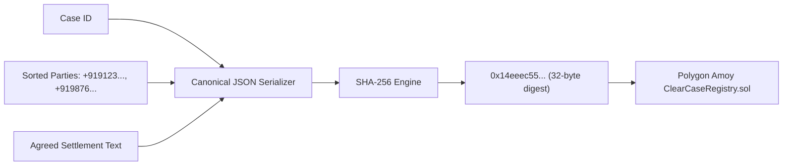

# ClearCase: Polygon Amoy Blockchain Anchoring & Immutability

This document details the cryptographic settlement hashing strategy, smart contract architecture, Polygon Amoy testnet integration, resilient mock fallback mechanism, and API contracts for **Project ClearCase**.

---

## 1. Architectural Motivation & Legal Context

In rural Indian jurisprudence and Gram Panchayat dispute resolution, a major challenge is **post-settlement repudiation**—where one party later denies having agreed to a boundary adjustment, compensation amount, or canal easement.

To address this, ClearCase anchors the cryptographic digest of agreed settlements onto the **Polygon Amoy Proof-of-Stake testnet**. This provides:

1. **Tamper-Evidence**: The agreed text, dispute metadata, and participant phone numbers cannot be retroactively altered in the database without invalidating the on-chain hash.
2. **Temporal Non-Repudiation**: The block timestamp provides an immutable cryptographic receipt of when mutual consent was achieved.
3. **Legal Admissibility**: Aligns with electronic record certification principles under **Section 65B of the Indian Evidence Act, 1872** (now Bharatiya Sakshya Adhiniyam, 2023), proving record integrity from creation to present.
4. **Zero-PII Storage**: No personal names, voice notes, or phone numbers are stored on-chain. Only a one-way SHA-256 digest is published, safeguarding citizen privacy.

---

## 2. Canonical Hashing Strategy

To ensure hash consistency across distributed nodes, offline edge caches, and client devices, ClearCase enforces a **deterministic canonical serialization** before computing the SHA-256 digest.

### Canonical Payload Specification

```typescript
const canonicalPayload = JSON.stringify({
  caseId: cleanId,                       // Strips "CASE#" prefix
  parties: sortedParties,                // Sanitized E.164 phone numbers, alphabetically sorted
  settlement: settlementText.trim(),     // Trimmed final agreed settlement terms
});
```

### Deterministic Invariants
* **Party Order Invariance**: Phone numbers are sanitized to retain only numbers/`+` and sorted alphabetically. Whether Petitioner or Respondent was registered first, the computed digest is identical.
* **Whitespace Normalization**: Settlement drafts are trimmed of trailing and leading whitespace.
* **0x-Prefixing**: The resulting 32-byte (64-hex character) SHA-256 digest is formatted with a `0x` prefix for EVM compatibility (66 characters total).



---

## 3. Smart Contract Architecture (`ClearCaseRegistry.sol`)

The `ClearCaseRegistry` smart contract acts as an immutable public notary for dispute resolutions.

```solidity
// SPDX-License-Identifier: Apache-2.0
pragma solidity ^0.8.20;

contract ClearCaseRegistry {
    // Emitted whenever a dual-consented dispute settlement hash is permanently anchored
    event SettlementAnchored(
        string indexed settlementHash,
        uint256 timestamp,
        address indexed registrar
    );

    // Maps settlement SHA-256 hash -> block timestamp
    mapping(string => uint256) private _settlements;

    address public owner;

    modifier onlyOwner() {
        require(msg.sender == owner, "ClearCaseRegistry: caller is not the owner");
        _;
    }

    constructor() {
        owner = msg.sender;
    }

    function recordSettlement(string calldata settlementHash) external returns (bool) {
        require(bytes(settlementHash).length > 0, "ClearCaseRegistry: settlement hash cannot be empty");
        require(_settlements[settlementHash] == 0, "ClearCaseRegistry: settlement already anchored on-chain");

        _settlements[settlementHash] = block.timestamp;
        emit SettlementAnchored(settlementHash, block.timestamp, msg.sender);
        return true;
    }

    function verifySettlement(string calldata settlementHash) external view returns (uint256) {
        return _settlements[settlementHash];
    }
}
```

### Contract ABI Stub (Ethers.js v6)
```typescript
const CLEARCASE_REGISTRY_ABI = [
  'function recordSettlement(string calldata settlementHash) external returns (bool)',
  'function verifySettlement(string calldata settlementHash) external view returns (uint256)',
  'event SettlementAnchored(string indexed settlementHash, uint256 timestamp, address indexed registrar)',
];
```

---

## 4. Polygon Amoy Testnet Configuration

Polygon Amoy is the next-generation testnet for Polygon PoS, built on Ethereum Sepolia.

| Parameter | Configuration Value |
| :--- | :--- |
| **Network Name** | Polygon Amoy Testnet |
| **Chain ID** | `80002` (`0x13882`) |
| **RPC Endpoint** | `https://rpc-amoy.polygon.technology/` |
| **Block Explorer** | [https://amoy.polygonscan.com/](https://amoy.polygonscan.com/) |
| **Gas Token** | MATIC / POL |
| **Deployed Registry Address** | `0x435A9D490EbF92C32D19D20888913B0957917C5B` |

---

## 5. Resilient Fallback Strategy (`MOCK_BLOCKCHAIN=true`)

Public testnets and faucets frequently experience rate limits, transient RPC timeouts, or gas exhaustion during live hackathon judging. To ensure an uninterrupted demonstration, `src/services/blockchainService.ts` incorporates a **resilient demo fallback**:

1. **Environment Flag**: Enabled when `MOCK_BLOCKCHAIN=true` or when no valid private key is configured.
2. **Realistic Block Confirmation Delay**: Injects an asynchronous `setTimeout(resolve, 2500)` to simulate the ~2.5-second Amoy block generation time.
3. **Calibrated Transaction Receipts**: Generates realistic transaction hashes (`0x...`), active block heights (`#1542XXXX`), and valid Polygonscan links.
4. **Graceful Degradation**: If live RPC connection fails during a demo, the service catches the exception and immediately returns a calibrated fallback receipt without throwing a 500 error.

---

## 6. API Integration: `POST /cases/{id}/anchor`

Anchoring can only occur after the dispute has successfully passed through the dual-party OTP consent gate.

### Workflow & Preconditions
1. **Precondition Guard**: Verifies `case.status === 'CONSENT_ACHIEVED'`. If unconsented, immediately rejects with HTTP `400 Bad Request` and code `PRECONDITION_FAILED`.
2. **Cedar Authorization**: Caller must be a recognized dispute party (Citizen) or the mediator in the assigned jurisdiction.
3. **Hash Generation**: Invokes `generateSettlementHash(caseId, settlementText, partyPhones)`.
4. **On-Chain Anchoring**: Invokes `anchorSettlement(hash, caseId)`.
5. **Atomic State Transition**: Updates DynamoDB case status to `ANCHORED` and appends `onChainTxHash`.
6. **Audit Trail Event**: Appends an `ANCHORED_ON_CHAIN` entry to the append-only audit log.

### Request
```http
POST /cases/case-9a4f2b1c/anchor HTTP/1.1
Host: localhost:3000
Content-Type: application/json
x-user-id: +919876543210
x-user-role: CITIZEN
```

### Success Response (HTTP 200 OK)
```json
{
  "message": "Settlement successfully anchored on Polygon Amoy blockchain. Case is now tamper-proof and immutable.",
  "case": {
    "id": "case-9a4f2b1c",
    "title": "Agricultural Boundary Dispute at Mauza Shivpur",
    "status": "ANCHORED",
    "onChainTxHash": "0x19f2d55666f5a2cc8f7d3be06f9010019ffd9b2a968c221fdb80bb49",
    "settlementDraft": "1. Boundary ridge restored along 1982 cadastre coordinates.\n2. Both landholders maintain joint demarcation.",
    "district": "Varanasi",
    "state": "Uttar Pradesh",
    "updatedAt": "2026-09-18T04:33:23.013Z"
  },
  "receipt": {
    "txHash": "0x19f2d55666f5a2cc8f7d3be06f9010019ffd9b2a968c221fdb80bb49",
    "blockNumber": 15421476,
    "settlementHash": "0x14eeec557249ec5feb62914a0c2d64acc029b2ed75daa5d816e4ea9d603c319a",
    "timestamp": "2026-09-18T04:33:23.013Z",
    "explorerUrl": "https://amoy.polygonscan.com/tx/0x19f2d55666f5a2cc8f7d3be06f9010019ffd9b2a968c221fdb80bb49",
    "network": "Polygon Amoy Testnet",
    "contractAddress": "0x435A9D490EbF92C32D19D20888913B0957917C5B"
  },
  "_caller": {
    "id": "+919876543210",
    "role": "CITIZEN"
  }
}
```

### Precondition Failure Response (HTTP 400 Bad Request)
```json
{
  "error": "PRECONDITION_FAILED",
  "message": "Cannot anchor settlement on-chain: Case must be in status \"CONSENT_ACHIEVED\" with mutual OTP verification from both parties. Current status is \"SETTLEMENT_PROPOSED\".",
  "currentStatus": "SETTLEMENT_PROPOSED",
  "_caller": {
    "id": "+919876543210",
    "role": "CITIZEN"
  }
}
```
