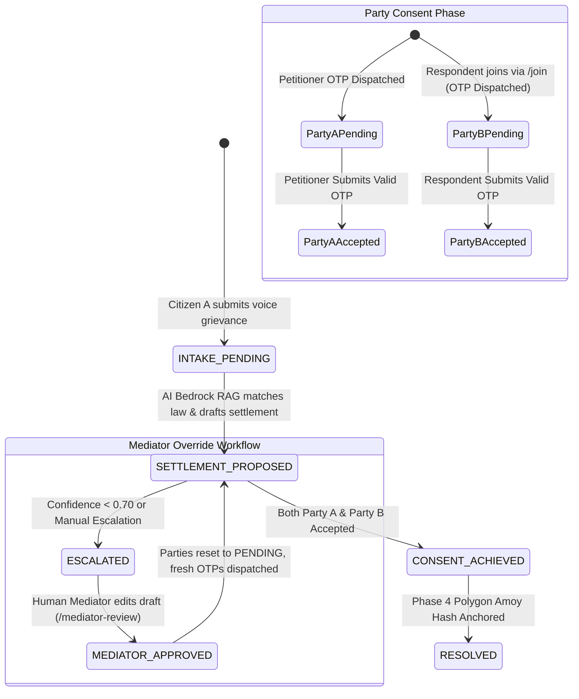

# ClearCase: Dual-Party OTP Consent Engine & SMS/IVR Simulation

This document describes the atomic dual-party e-consent state machine, Twilio/Exotel SMS & IVR simulation, and mediator draft reset workflows for **Project ClearCase**.

---

## 1. Dual-Party Consent State Machine

Informal village settlements can only be considered credible if **both** disputing parties independently and cryptographically express informed agreement. ClearCase mandates a dual-party OTP confirmation gate before any settlement can be anchored on-chain.



---

## 2. Detailed Step-by-Step Flow

### Step 1: Grievance Intake & Petitioner OTP
* Citizen A (Petitioner) records their grievance in regional dialect (e.g. Bhojpuri).
* `POST /cases` registers the case in DynamoDB and creates Party A (`ROLE: PETITIONER`).
* A 6-digit OTP is generated with a 15-minute Time-to-Live (`otpExpiry`).
* The system logs an outbound simulated SMS and IVR voice-note:
  ```
  [SMS/IVR Stub: Twilio/Exotel] Outbound SMS Dispatch -> Destination: +919876543210
  [SMS/IVR Stub: Twilio/Exotel] Simulated Payload: "ClearCase e-Consent OTP: 131440. Valid for 15 mins."
  [SMS/IVR Stub: Twilio/Exotel] Vernacular IVR Voice-Note: "Aapka samjhauta sweekriti code 1 3 1 4 4 0 hai."
  ```

### Step 2: AI Formulation of Settlement Draft
* The Bedrock Claude 3.5 Sonnet RAG pipeline creates a plain-language compromise proposal.
* Status is updated to `SETTLEMENT_PROPOSED` (or `ESCALATED` if confidence $< 0.70$).

### Step 3: Respondent Join & OTP Dispatch
* Citizen B (Respondent) joins the case using the invitation link or phone number:
  ```http
  POST /cases/{id}/join
  Content-Type: application/json

  {
    "name": "Harish Chandra Singh",
    "phone": "+919123456780",
    "role": "RESPONDENT"
  }
  ```
* Party B is added with status `PENDING`, and a unique 6-digit OTP is dispatched to their phone.

### Step 4: Individual Confirmation
* Each party confirms agreement by submitting their 6-digit OTP:
  ```http
  POST /cases/{id}/confirm
  x-user-id: +919876543210
  Content-Type: application/json

  {
    "phone": "+919876543210",
    "otp": "131440"
  }
  ```
* The endpoint verifies OTP validity, non-expiry, and updates `consentStatus` to `ACCEPTED`.
* The `AuditRepository` appends an immutable `OTP_VERIFIED` record.

### Step 5: Atomic Dual-Consent Check
* After each verification, `evaluateDualPartyConsent(caseId)` checks:
  1. Does Party A (`PETITIONER`) have status `ACCEPTED`?
  2. Does Party B (`RESPONDENT`) have status `ACCEPTED`?
* **If only one party has accepted**:
  The response reports `consentAchieved: false`. The case remains in `SETTLEMENT_PROPOSED`.
* **If BOTH parties have accepted**:
  The case atomically transitions to `CONSENT_ACHIEVED`. An immutable audit event `CONSENT_ACHIEVED` is recorded. The case file is now locked and ready for cryptographic hashing and blockchain anchoring on Polygon Amoy testnet.

---

## 3. Human Mediator Override & Re-Consent Reset

If a case is escalated to human review (`ESCALATED`) or if a mediator intervenes:
1. The mediator calls `PATCH /cases/{id}/mediator-review` with the revised draft and statutory citations.
2. The case status transitions to `MEDIATOR_APPROVED`.
3. `partyRepo.resetPartiesConsent(caseId)` resets *both* disputants' consent statuses back to `PENDING`.
4. Fresh, unique 6-digit OTPs are generated and dispatched via the Twilio/Exotel stub.
5. Both parties must review the mediator-amended draft and submit their new OTPs before `CONSENT_ACHIEVED` is reached.
